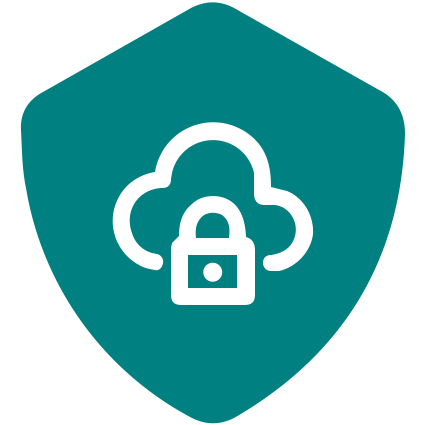

<a name="readme-top"></a>

<div align="center">

[![Contributors][contributors-shield]][contributors-url]
[![Forks][forks-shield]][forks-url]
[![Stargazers][stars-shield]][stars-url]
[![Issues][issues-shield]][issues-url]
[![Apache License 2.0][license-shield]][license-url]

</div>
<br />
<div align="center">
  <a href="https://github.com/codehasan/SecurePaste">
    
  </a>

  <h3 align="center">SecurePaste</h3>

  <p align="center">
    A secure Pastebin alternative with blockchain-powered encryption and decentralized storage.
    <br />
    <code>PROJECT UNDER DEVELOPMENT</code>
    <br/>
    Check <a href="#roadmap">Roadmap</a> to see current progress.
    <br />
    <br />
    <a href="https://github.com/codehasan/SecurePaste">View Demo</a>
    &nbsp;
    |
    &nbsp;
    <a href="https://github.com/codehasan/SecurePaste/issues/new?labels=bug&template=bug-report---.md">Report Bug</a>
    &nbsp;
    |
    &nbsp;
    <a href="https://github.com/codehasan/SecurePaste/issues/new?labels=enhancement&template=feature-request---.md">Request Feature</a>
  </p>
</div>

<details>
  <summary>Table of Contents</summary>
  <ul>
    <li>
      <a href="#about-the-project">About The Project</a>
      <ul>
        <li><a href="#key-features">Key Features</a></li>
        <li><a href="#common-features-pastebin">Common Features</a></li>
        <li><a href="#built-with">Built With</a></li>
      </ul>
    </li>
    <li>
      <a href="#install">Install</a>
      <ul>
        <li><a href="#prerequisites">Prerequisites</a></li>
        <li><a href="#installation">Installation</a></li>
      </ul>
    </li>
    <li><a href="#roadmap">Roadmap</a></li>
    <li><a href="#contributing">Contributing</a></li>
    <li><a href="#license">License</a></li>
    <li><a href="#contact">Contact</a></li>
    <li><a href="#acknowledgments">Acknowledgments</a></li>
  </ul>
</details>

## About The Project

[![Product Banner][product-screenshot]](https://github.com/codehasan/SecurePaste)

This project is built as an alternative to Pastebin. The key difference is that SecurePaste allows users to store their content on Blockchain to ensure data integrity and immutability.
Moreover it's tailored for ease of use, allowing users to securely store their data and also have the freedom to select between Web3 (Blockchain) and Web2 (Traditional) storage methods, ensuring both security and convenience are prioritized.

### Key Features:

- **Blockchain-Powered Encryption:** Encrypt your data with asymmetric cryptography to maximize data integrity.
- **Decentralized Storage:** Choose decentralized storage options like `IPFS` for data resilience and privacy.
- **Data Immutability:** Private contents are stored in the Blockchain using Smart Contracts.
- **User-Friendly Interface:** Intuitive design makes it easy to securely store and manage your content.
- **Customizable Sharing:** Share your stored content publicly or restrict content visibility to private only.

### Common Features (Pastebin):

- **Syntax Highlighting:** Enable syntax highlighting for your desired language in your stored content.
- **Custom Tags:** Apply multiple tags to categorize your content.

Whether you’re a developer safeguarding sensitive code or an individual protecting personal notes, our platform offers a reliable solution backed by the latest technologies in blockchain innovation.

### Built With

The project is built using the following libraries and frameworks.

- 
- 
- 
- 
- 

For database and storage, the following tools are used.

- 
- 
- 

Smart Contracts are deployed on the `Ethereum` blockchain and developed using the following tools and languages.

- 
- 
- 
- 

## Install

To run this project locally follow the below steps.

### Prerequisites

- Make sure you have `hardhat` installed globally.

  ```sh
  npm install hardhat@latest -g
  ```

- Install MetaMask wallet extension for your browser.

  <a href="https://chromewebstore.google.com/detail/metamask/nkbihfbeogaeaoehlefnkodbefgpgknn">Chrome Web Store</a>
  &nbsp;|&nbsp;
  <a href="https://addons.mozilla.org/en-US/firefox/addon/ether-metamask">Firefox Addons</a>

### Installation

- Clone the repo

  ```sh
  git clone https://github.com/codehasan/SecurePaste.git
  ```

- Install NPM packages for EVM

  ```sh
  npm install
  ```

- Install NPM packages for frontend

  ```sh
  cd frontend
  npm install
  ```

- Enter your MongoDB database URL in `frontend/.env.local`

  ```js
  MONGO_URI=mongodb+srv://<username>:<password>@cluster0.mongodb.net/<dbname>?retryWrites=true&w=majority
  ```

- Start hardhat node

  ```sh
  npx hardhat node
  ```

- Run the project in development mode

  ```sh
  cd frontend
  npm run dev
  ```

## Roadmap

- [x] Build project structure
- [ ] Build backend api to handle requests
- [ ] Build user login system
- [ ] Create page to create new pastes
- [ ] Create page to view pastes
- [ ] Create page to edit pastes

See the [open issues](https://github.com/codehasan/SecurePaste/issues) for a full list of proposed features (and known issues).

## Contributing

Contributions are what make the open source community such an amazing place to learn, inspire, and create. Any contributions you make are **greatly appreciated**.

If you have a suggestion that would make this better, please fork the repo and create a pull request. You can also simply open an issue with the tag "enhancement".
Don't forget to give the project a star! Thanks again!

1. Fork the Project
2. Create your Feature Branch (`git checkout -b feature/AmazingFeature`)
3. Commit your Changes (`git commit -m 'Add some AmazingFeature'`)
4. Push to the Branch (`git push origin feature/AmazingFeature`)
5. Open a Pull Request

## License

Distributed under the Apache License (2.0) . See `LICENSE` for terms and conditions.

```
Copyright (c) 2024 Ratul Hasan

Licensed under the Apache License, Version 2.0 (the "License");
you may not use this file except in compliance with the License.
You may obtain a copy of the License at

       http://www.apache.org/licenses/LICENSE-2.0

Unless required by applicable law or agreed to in writing, software
distributed under the License is distributed on an "AS IS" BASIS,
WITHOUT WARRANTIES OR CONDITIONS OF ANY KIND, either express or implied.
See the License for the specific language governing permissions and
limitations under the License.
```

## Contact

You can contact me using either of these social media platforms or send me an email.

- [](https://www.linkedin.com/in/codehasan)
- [](https://t.me/codehasan)
- [](https://twitter.com/code_hasan)
- [](mailto:ratul.hasan.rahat.bd@gmail.com)

---

<p align="right"><a href="#readme-top">Back to top</a></p>

[contributors-shield]: https://img.shields.io/github/contributors/codehasan/SecurePaste.svg?style=for-the-badge
[contributors-url]: https://github.com/codehasan/SecurePaste/graphs/contributors
[forks-shield]: https://img.shields.io/github/forks/codehasan/SecurePaste.svg?style=for-the-badge
[forks-url]: https://github.com/codehasan/SecurePaste/network/members
[stars-shield]: https://img.shields.io/github/stars/codehasan/SecurePaste.svg?style=for-the-badge
[stars-url]: https://github.com/codehasan/SecurePaste/stargazers
[issues-shield]: https://img.shields.io/github/issues/codehasan/SecurePaste.svg?style=for-the-badge
[issues-url]: https://github.com/codehasan/SecurePaste/issues
[license-shield]: https://img.shields.io/github/license/codehasan/SecurePaste.svg?style=for-the-badge
[license-url]: https://github.com/codehasan/SecurePaste/blob/master/LICENSE.txt
[product-screenshot]: frontend/public/banner.png
